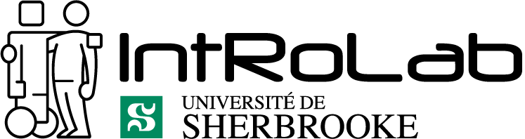

# opentera-webrtc-teleop

[WebRTC](https://webrtc.org/) is a standard for real-time audio/video/data communication and is mostly used in web browsers.
For the [OpenTera](https://github.com/introlab/opentera) micro-service architecture, we wanted to use Google's native WebRTC implementation for robots so we would have more control on the streams and develop a framework that is optimized for robot teleoperation. This project provides:

* [A signaling server](signaling-server) written in Python that can be used as a stand-alone server or embedded in our [OpenTera Teleoperation Micro-Service](https://github.com/introlab/opentera-teleop-service)
* [A native libwebrtc wrapper](opentera-webrtc-native-client/OpenteraWebrtcNativeClient/src) that is used as a C++ base library for clients using our signaling server.
* [Python 3 bindings](opentera-webrtc-native-client/OpenteraWebrtcNativeClient/python) that are used as a Python module for clients using our signaling server.
* [A Javaccript library](opentera-webrtc-web-client) That is used for web client developement and teleoperation interface using our signaling server.

## Dependencies

* Most dependencies are part of the project with git submodules in the [opentera-webrtc-native-client/3rdParty](opentera-webrtc-native-client/3rdParty) directory.
* OpenCV needs to be installed on the system.

## ROS

* The C++ library and Python bindings are used in our [opentera_webrtc_ros ROS package](https://github.com/introlab/opentera-webrtc-ros). RGB images published in ROS topics can be easily used for streaming in a RTCPeerConnection using our signaling server.

## Frontend

* The Javacript library is used for our [opentera WebRTC teleoperation frontend](https://github.com/introlab/opentera-webrtc-teleop-frontend).

## Examples

### C++

* [data-channel-client](examples/cpp-data-channel-client)
* [stream-client](examples/cpp-stream-client)

### Python

* [data-channel-client](examples/python-data-channel-client)
* [stream-client](examples/python-stream-client)

### Javascript

* [data-channel-client](examples/web-data-channel-client)
* [stream-client](examples/web-stream-client)
* [stream-data-channel-client](examples/web-stream-data-channel-client)

## Authors

* Marc-Antoine Maheux (@mamaheux)
* Cédric Godin (@godced)
* Dominic Létourneau (@doumdi)

## License

* [Apache License, Version 2.0](LICENSE)

## Sponsor

[IntRoLab - Intelligent / Interactive / Integrated / Interdisciplinary Robot Lab](https://introlab.3it.usherbrooke.ca)
